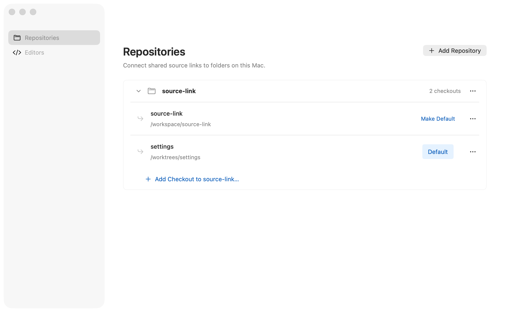
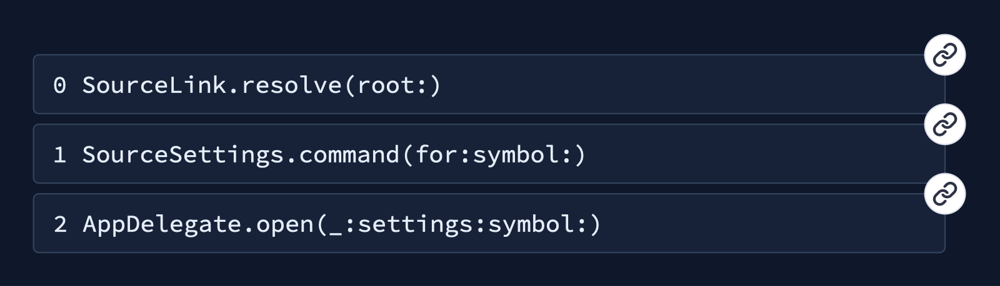

# Source Link

A macOS 15+ menu-bar utility that opens portable source links in your preferred local editor.
Share a link once; each person maps the repository to their own checkout or worktree.

```text
source-link://my-repo/Sources/My%20File.swift?line=42&column=3
```



Supports Xcode, VS Code, Cursor, Zed, Android Studio, IntelliJ IDEA, Sublime Text, and custom editor profiles. Runs in the menu bar with no Dock icon.

## Demo

Watch all three terminal links and all three D2 graph links open their Swift
declarations in Xcode in this 24-second demo. The graph and terminal are on the left;
Xcode is on the right.

https://github.com/user-attachments/assets/2fc71909-127a-4938-9d0c-16b8aa728b77

## Homebrew installation

Homebrew is the supported distribution route. The cask installs the app and links its bundled
`source-link` command into `$(brew --prefix)/bin`. Open **Source Link** from Applications
to configure your repositories and editor, then use the command in your terminal.
End users do not need Swift, Xcode, or a checkout of Source Link itself to run the CLI.

The first release and Homebrew cask still need to be published; see the
[release workflow](docs/contributing.md#prepare-a-homebrew-release).

```sh
source-link validate document.md
```

Validation reports ambiguous symbol links with their matching declarations. Use
`source-link validate --require-unique-symbols document.md` to reject ambiguity in CI.

The command uses the app's saved repository mappings. Homebrew manages the app and command
together, including upgrades and removal.

## Symbol links

Swift, Ruby, Kotlin, and TypeScript files support declaration links:

```text
source-link://my-repo/Sources/Widget.swift?symbol=Widget.refresh(force:)
source-link://my-repo/lib/cart.rb?symbol=Shop::Cart%23add
source-link://my-repo/src/Cart.kt?symbol=shop.Cart.add
source-link://my-repo/src/Cart.ts?symbol=Shop.Cart.add
source-link://my-repo/src/View.tsx?symbol=Shop.View
```

Supported extensions are `.swift`, `.rb`, `.kt`, `.kts`, `.ts`, `.mts`, `.cts`, and `.tsx`,
case-insensitively. TypeScript declaration files such as `.d.ts` are included.
Short names such as `add` work in every language; qualified names follow each language's conventions:

| Language | Qualified name examples |
| --- | --- |
| Swift | `Widget.title`, `Widget.refresh(force:)` |
| Ruby | `Shop::Cart`, `Shop::Cart#add` (instance method), `Shop::Cart.build` (singleton method) |
| Kotlin | `shop.Cart.add` (includes the package), `shop.String.render` (extension receiver) |
| TypeScript / TSX | `Shop.Cart.add`, `Shop.View` (lexical namespaces and declarations) |

In Swift, use a type or property name (`Widget`, `Widget.title`), a function with argument labels
(`Widget.refresh(force:)`), or a short name (`refresh`). Qualified names include enclosing
types and callable argument labels (`Host.outer(value:).inner()`). Members declared in
extensions and associated-value enum cases (`Event.payload(value:)`) are supported.
Ruby, Kotlin, and TypeScript use declaration names without parameter lists.
One match opens immediately. Multiple matches show a borderless floating picker with signatures
and line numbers. Use ↓ or j to move down, ↑ or k to move up, and Enter to open. Escape or
moving focus away dismisses the picker. No matches produce an error.

The file is required, and `symbol` cannot be combined with `line` or `column`. URL-encode
special characters in symbol names, including Ruby's `#` as `%23`. Lookup uses
[SourceSymbols](https://github.com/swift-student/swift-source-symbols) and its bundled
Tree-sitter parsers against the current file on disk, selecting the language by file extension,
without building or indexing the repository. Symbol lookup needs no installed language toolchain
or separate parser executable.
Links survive line changes, but not declaration renames or file moves. Parameter names are
metadata, not link targets, except Kotlin constructor parameters declared with `val`/`var`,
which are properties. Separately declared variables are supported where the language backend
extracts them. Macros, dynamic Ruby declarations, and generated declarations are not supported.

Lookup is syntactic: declarations from all conditional-compilation branches can appear.
Incomplete or unrecognized syntax may yield partial results; recovered declarations remain
navigable even when parsing reports diagnostics. The picker shows declaration headers when
available, otherwise qualified names, alongside line numbers.

### Locations within declarations

Add `find` to target a literal snippet inside a symbol's declaration:

```text
source-link://my-repo/Sources/Store.swift?symbol=Store.commit(_:)&find=outbox.append
```

The resolver searches the entire source range of every matching declaration, including
overloads, headers, comments, strings, and nested declarations. One matching location
opens immediately at the snippet's start. Multiple occurrences show a picker with source
line previews, declaration signatures, and line/column positions, including repeated text
within one method. Overlapping declaration ranges show each physical match only once.
Missing symbols or snippets produce errors; there is no fallback to a declaration or the rest of the file.

`find` requires `symbol`, must be nonempty, and cannot be combined with `line` or `column`.
Matching is case-sensitive and byte-exact: no regex, whitespace normalization, or Unicode
normalization. Spaces, tabs, and newlines are significant; multiline snippets must use the
file's actual newline sequence. Overlapping occurrences count as separate matches.
Percent-encode query values, including `&` as `%26`, `#` as `%23`, and `%` as `%25`;
values are decoded once. SVG/HTML attributes must also escape query separators as `&amp;`.

These links survive inserted lines and moved statements within the selected declaration
as long as the symbol and snippet remain unchanged. Choose a short, distinctive snippet.
`source-link validate` warns about multiple final locations by default;
`--require-unique-symbols` rejects them after `find` filtering.

## Source-linked call stacks

The [interactive explainer](https://swiftstudent.com/source-link/) uses clickable
stack frames and a D2 flow to explain how Source Link opens local code.
See [site development and deployment](site/README.md).

Use Source Link to turn diagrams and debugging notes into shortcuts to local code.
This simulated call stack links each frame to its Swift declaration using `?symbol=`,
so the links keep working when line numbers change.



[Download the clickable SVG](examples/diagrams/stack-trace.svg?raw=1) and open it as a document,
then click a frame to jump into your editor. Map `source-link` to your local checkout.
The preview above is static. [Editable D2 source](examples/diagrams/stack-trace.d2).

## Build and run

Requires macOS 15+, Xcode with Swift 6.2+, and these development tools:

```sh
brew install xcodegen swiftlint swiftformat
git clone https://github.com/swift-student/source-link.git
cd source-link
make run
```

This builds and opens `.build/xcode/Build/Products/Debug/source-link.app`.
To keep the app, copy it to Applications. Install your preferred editor separately.

## Open your first link

Open a link to the README:

```sh
open 'source-link://source-link/README.md?line=1'
```

Source Link prompts you to choose the repository’s local folder and an editor, then opens
the file. No Settings changes are needed beforehand. You can manage repository mappings
and editors in Settings later.

## Guides

- [Usage and link format](docs/usage.md): repositories, worktrees, editor routing, and path rules.
- [Document validation](docs/validation.md): check every Source Link URL from the terminal.
- [Configuration](docs/configuration.md): JSON reference, dotfiles, external edits, and CLI validation.
- [Troubleshooting](docs/troubleshooting.md): setup, editor failures, and save recovery.
- [Contributing](docs/contributing.md): build tools, tests, formatting, and visual review.
- [Architecture](docs/architecture.md): code map and design decisions.
- [Source-linked diagrams](examples/diagrams/README.md): examples and the reusable [diagram skill](skills/source-link-diagrams/SKILL.md).
